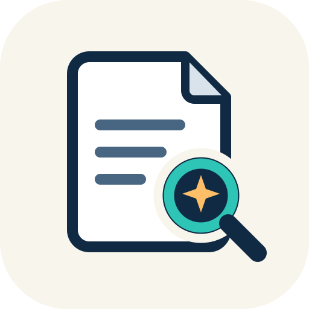

<p align="center">
  
</p>

<h1 align="center">paper-agent</h1>

<p align="center">Academic literature workflows from the command line.</p>

**Current release: v4.0.0** · Python 3.10+ · [Releases](https://github.com/croni4666-cmd/paper-agent/releases)

**使用文档 / User guides:** [English](docs/usage.md) · [简体中文](docs/usage_zh.md)

Paper-agent runs locally, while search, download, enrichment, Zotero sync, and other connected workflows may contact external services. Review each command's help and your institution's terms before use. Paper-agent does not guarantee that search results are complete or that generated summaries are scientifically accurate.

## Start here

```console
python -m pip install -e .
pa --help
pa search "AI literacy" --year-min 2020 --limit 20 --format bibtex -o refs.bib
```

The [usage guides](docs/usage.md) and [中文使用指南](docs/usage_zh.md) cover installation, search, references, downloads, review drafts, Zotero, and troubleshooting. Use `pa <command> --help` for the exact options in your installed version.

## What it supports

- Search scholarly metadata across supported providers and export JSON or BibTeX.
- Check BibTeX citations, create an outline, and build a manuscript from your own draft.
- Organize topic-specific reference projects and export screening data.
- Work with a local PDF collection to draft a literature review and PRISMA flow diagram.
- Optionally connect Zotero, Obsidian, or the local gateway for supported workflows.

Provider availability, fields, rate limits, and access terms vary. A successful command is not a substitute for checking the source record, the paper, or your rights to access and use a file.

## v4 gateway note

Version 4 uses a local transactional SQLite journal for gateway accounting. If you have an existing v3 gateway ledger, read the [operating and migration guide](docs/gateway-v4.md) before running gateway requests. Mixed v3/v4 writers are not supported, and migration requires preserving and reconciling the old ledger.

## Scope and validation

Real-corpus collection, human labels, and corpus-dependent evaluation are indefinitely suspended. The release's automated checks cover software consistency and generated fixtures; they do not establish scientific quality or accuracy gains.

## Documentation

- [English usage guide](docs/usage.md)
- [简体中文使用指南](docs/usage_zh.md)
- [v4 gateway operation and migration](docs/gateway-v4.md)
- [v4 reliability quality gate](docs/v4-quality-gate.md)
- [Repository icon PNG](assets/paper-agent-icon.png)
- [Changelog](CHANGELOG.md)
- [License and use restrictions](LICENSE)

## License

See [LICENSE](LICENSE) for the complete terms and restrictions.
